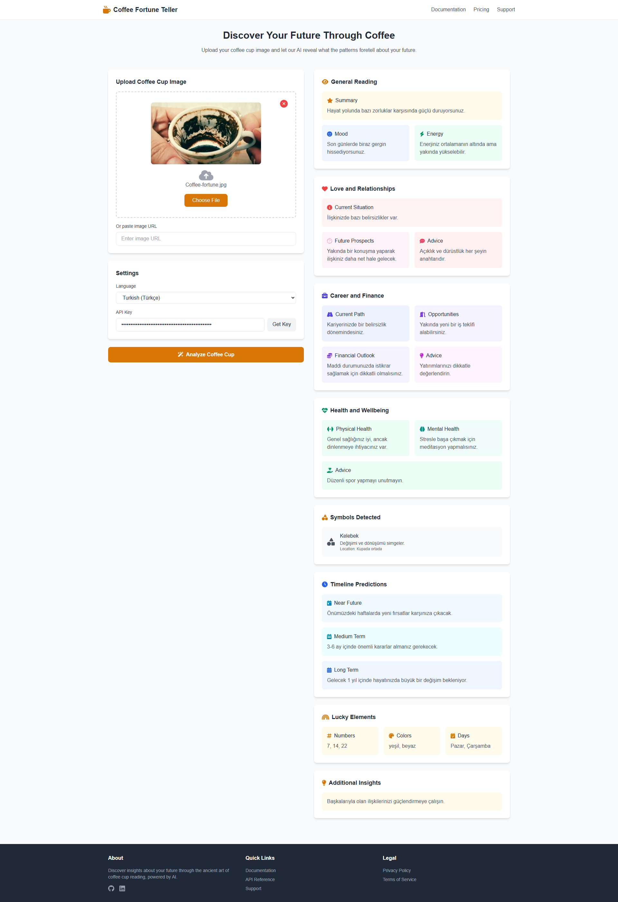

# AI Coffee Cup Fortune Teller



A modern web application that uses AI to read and interpret Turkish coffee cup fortunes. This application provides detailed insights about your future by analyzing patterns in coffee grounds through advanced AI technology.

## 🌟 Features

- **Instant Fortune Reading**: Upload your coffee cup image or provide an URL for immediate analysis
- **Comprehensive Analysis**:
  - General Reading (Summary, Mood, Energy)
  - Love and Relationships
  - Career and Finance
  - Health and Wellbeing
  - Symbols Detection
  - Timeline Predictions
  - Lucky Elements

- **Multiple Input Methods**:
  - Drag and drop image upload
  - File selection
  - Image URL input

- **Multi-Language Support**: Available in 30 languages including:
  - English
  - Turkish (Türkçe)
  - Arabic (العربية)
  - Spanish (Español)
  - French (Français)
  - German (Deutsch)
  - And many more...

- **Modern UI Features**:
  - Responsive design
  - Real-time image preview
  - Loading animations
  - Error notifications
  - State persistence in URL

## 🛠️ Technical Features

- Pure HTML/JavaScript implementation
- TailwindCSS for styling
- FontAwesome icons
- RapidAPI integration
- Base64 state management
- Drag and drop file handling
- FormData for image uploads

## 📝 API Integration

This project uses the [Coffee Fortune Teller API](https://rapidapi.com/ltdbilgisam/api/coffee-fortune-teller-read-coffee-cup-personal-advice) from RapidAPI. To use the application:

1. Sign up on RapidAPI
2. Subscribe to the Coffee Fortune Teller API
3. Get your API key
4. Enter the API key in the application

## 🔧 Setup

1. Clone the repository:
```bash
git clone https://github.com/smtkuo/ai-read-coffee-cup.git
```

2. Open `index.html` in your browser

No build process required! The application uses CDN-hosted dependencies.

## 📱 Responsive Design

The application is fully responsive and works on:
- Desktop computers
- Tablets
- Mobile phones